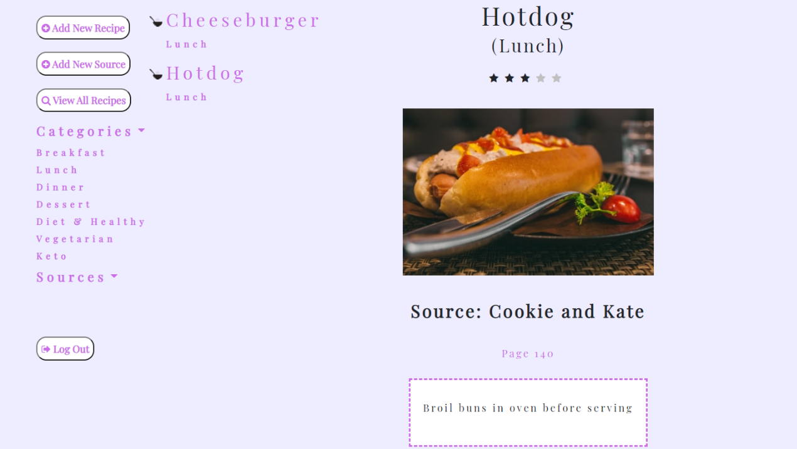
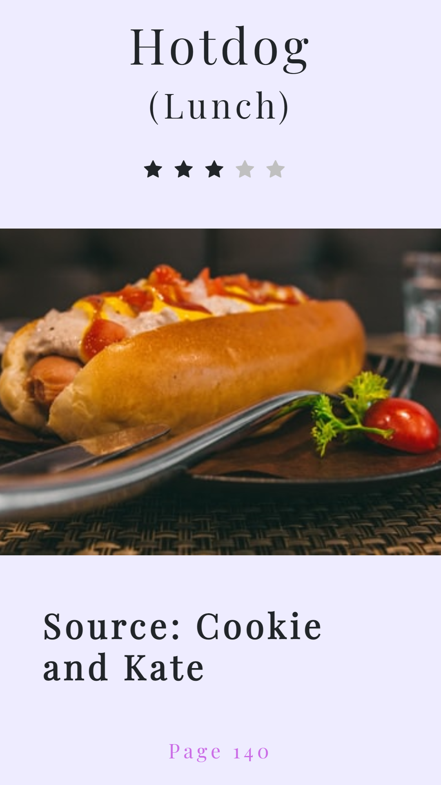

# Recip-EZ

<div>
  
  


</div>

### All the recipes you've been dying to try

### All of your favorites

### All in one convenient place.

<br>

## Table of Contents

- [Features](#Features)
- [Installation](#Installation)
- [Usage](#Usage)
- [Technologies](#Technologies-Used)
- [Contributing](#Contributing)
- [Reflection](#Reflection)
- [Future Scope](#Future-Scope)
- [Questions](#Questions)

## Features

- Secure Login using Passport.js
- User/recipe info stored in database using Sequelize
- Recipe images retrieved automatically via Unsplash API

## Installation

1. Install npm packages:
   ```
   npm i express sequelize passport
   ```
2. Be sure to update `config.json` with your development database credentials
3. Create (empty) database `recipeEZ_db` in your preferred database tool using provided `schema.sql`
4. Run `node server` in terminal and open `localhost:8080` (or your configured server port) in your browser

## Usage
Currently deployed with [Heroku](https://recipez417.herokuapp.com/home)

1. Login with username & password, or sign up for a free account
2. Click `Add Recipe` button to enter a new recipe reference
3. Fill out form with details/notes/rating and save to your collection
4. Search your collection for a specific source or meal category

   
   

## Technologies Used

- [Express](https://expressjs.com/)
- [Sequelize](https://sequelize.org/)
- [Passport.js](https://www.passportjs.org/)
- [Axios](https://www.npmjs.com/package/axios)
- [Unsplash Image API](https://unsplash.com/developers)

## Contributing

Contributions welcome!

1. Fork this repository
2. Create a new branch
3. Commit/push your changes
4. Create a new pull request

## Reflection

- Used MVC model to structure public HTML/CSS/JS, Sequelize models, and server-side API routes
- Deepened understanding/ability to prioritize tasks and produce MVP more quickly
- Increased familiarity with agile workflow and resolving git conflicts

## Future Scope

- Easily update/delete any recipe with `Edit`/`Delete` buttons in recipe view
- Add option for user to upload custom images for their recipes
- Update database to store recipe ingredients/instructions
- Allow customizable categories
- Share recipes with other Recip-EZ users

## Questions  
If you have any questions, feel free to create an [Issue](https://github.com/joeldore/Recipe-Organizer/issues)

## License
This project is [MIT](https://github.com/joeldore/Recipe-Organizer/blob/main/LICENSE) licensed.  

---

<div align="center" style="display:flex; width:100%; flex-direction:row; justify-content:center; align-items:center">
    
<div style="margin-right:1rem">
<h3>Kasey Cushing</h3>
<a href="https://www.github.com/kcushing1"></a> <a href="https://www.linkedin.com/in/kasey-cushing-053bbab1"></a>
</div>
<div style="margin-right:1rem">
<h3>Michael Hernandez</h3>
<a href="https://www.github.com/MH4454"></a> <a href="https://www.linkedin.com/in/michael-hernandez-303a8ba3"></a>
</div>
<div style="margin-right:1rem">
<h3>Seth Kalback</h3>
<a href="https://www.github.com/skalback"></a> <a href="https://www.linkedin.com/in/seth-kalback-a067b091"></a>
</div>
<div style="margin-right:1rem">
<h3>Jacob Krueger</h3>
<a href="https://www.github.com/GeminiTrinity"></a> <a href="https://www.linkedin.com/in/jacobmkrueger"></a>
</div>
<div style="margin-right:1rem">
<h3>Joel Dore</h3>
<a href="https://www.github.com/joeldore"></a> <a href="https://www.linkedin.com/in/joeldore"></a>
</div>

</div>
